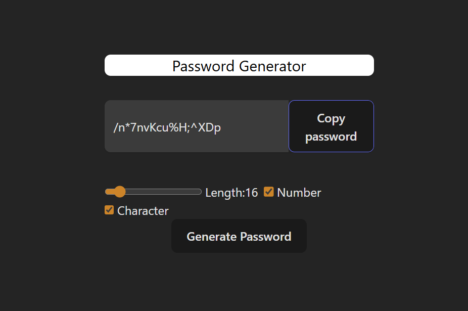

# 🔐 Password Generator

A lightweight, responsive password generator built with **React** and **Tailwind CSS**. Instantly generate secure passwords with customizable length and character sets — and copy them to your clipboard in one click.

---

## ✨ Features

- 🔡 **Alphabetic base** — uppercase and lowercase letters always included
- 🔢 **Optional numbers** — toggle digits 0–9
- 🔣 **Optional special characters** — toggle symbols like `!@#$%^&*`
- 📏 **Adjustable length** — slider from 6 to 100 characters
- 📋 **One-click copy** — copies password to clipboard and highlights the field
- ⚡ **Auto-regenerate** — new password generated automatically on any setting change

---

## 🛠️ Tech Stack

| Tech | Purpose |
|---|---|
| React 18 | UI & state management |
| Tailwind CSS | Styling |
| `useState` | Manages password, length, and toggle states |
| `useCallback` | Memoizes generator and copy functions |
| `useEffect` | Auto-generates on dependency change |
| `useRef` | DOM ref for input selection on copy |

---

## 🚀 Getting Started

### Prerequisites
- Node.js v16+
- npm or yarn

### Installation

```bash
# Clone the repository
git clone https://github.com/your-username/password-generator.git

# Navigate into the project
cd password-generator

# Install dependencies
npm install

# Start the development server
npm run dev
```

Then open [http://localhost:5173](http://localhost:5173) in your browser.

---

## 📁 Project Structure

```
password-generator/
├── src/
│   ├── App.jsx        # Main component — all logic lives here
│   ├── App.css        # Component-level styles
│   └── index.css      # Global styles (Tailwind base)
├── public/
├── index.html
└── package.json
```

---

## 🧠 How It Works

1. **`generatePassword`** — builds a character pool based on toggles, then randomly picks characters up to the selected length using `Math.random()`.
2. **`useEffect`** — watches `length`, `isNumber`, and `isChar`; calls `generatePassword` whenever any of them changes.
3. **`copyPassword`** — uses `useRef` to select the input text and `navigator.clipboard.writeText()` to copy it.

---

## 📸 Preview



---

## 📄 License

This project is for learning purposes only. No license is provided.
